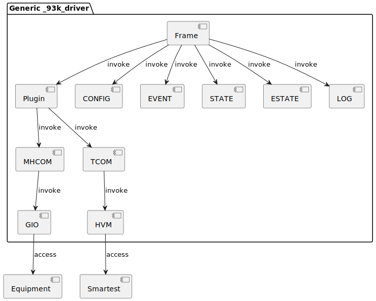
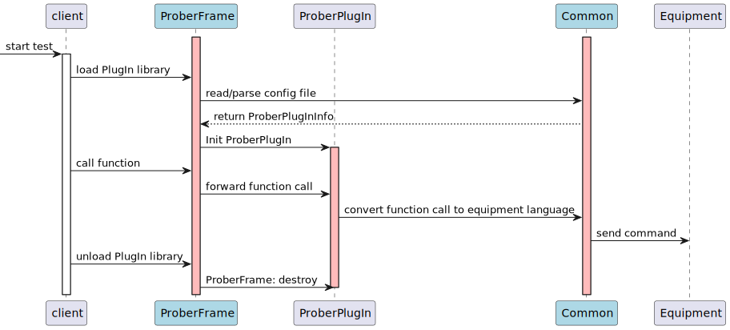

# Generic Prober Driver <!-- replace this with your architectural element name -->

<!-- To see a rendered version of this document in a BitBucket review, -->
<!-- please click the "View full file" icon -->
<!-- To see a rendered version of this document in the Eclipse IDE, -->
<!-- open the FluentMark viewer (Ctrl-3 Fluent) -->
<!-- To see a rendered version of this document in Visual Studio Code, -->
<!-- please install extension 'Markdown All in One'. -->
<!-- See also https://weshare.advantest.com/vs/pages/viewpage.action?pageId=194087161 -->

ID:DES.11872.2 <!-- Go to http://socbm250.bbn.verigy.net:8000/ to generate a new ID. -->
<!-- You can also use hierarchical numbering like ID:DES.99999.9 -->
<!-- if you describe a part of a design, e.g. a unit, in a separate file -->

<!-- The numbering of the individual sections might help when referencing -->
<!-- to a certain section, but feel free to remove the numbers if you don't like it -->

## 1 Description
<!-- Describe the architectural element here. If helpful, also use diagrams, graphics, ... -->
- Generic Prober driver support communication between 93k tester and Probers.
- The drivers are automatically installed with the installation of a Test Cell Access package.

### 1.1 Core functionalities <!-- This subtopic can be removed if the information is already part of this main description. -->
<!-- List the core functionalities of the architectural element here. -->
- Support GPIB interface
- Support RS232 interface
- Support LAN interface

### 1.2 Important entities / interfaces <!-- This subtopic can be removed if the information is already part of this main description. -->

<!-- In a design overview document, the interfaces don't need to be described here, -->
<!-- they are covered in the architecture documentation -->

- The driver supported functions see [Driver Functions](http://tdc.adv.advantest.com/help/index.jsp#topic/com.verigy.itee.help.smartest.ui.8.5.1/352570.htm)

<!-- In a unit design document, highlight the important entities (interfaces, -->
<!-- classes, data structures, code generators, ...) -->
<!-- Comments in source files (e.g. .hpp/.java) are a crucial part part of -->
<!-- interface documentation, please reference those files: -->

### 1.3 Design rationale and alternatives <!-- This subtopic can be removed if the information is already part of this main description. -->
<!-- The reason behind decisions made when designing this architectural element. -->
<!-- Is there any other alternatives? What is the reason for the final decision? -->
- Generic driver incluing frame and plugin level.
  - frame level provide common communication to tester and equipment.
  - plugin level provide specific communication command for different type probers.

### 1.4 Static view <!-- This subtopic can be removed if the information is trivial -->
<!-- Describe the static view of the unit(s) and the used data structures by using -->
<!-- class diagram(s), a textual description or ... -->

### 1.5 Dynamic view <!-- This subtopic can be removed if the information is trivial -->
<!-- Describe the dynamic view of the unit(s) by using activity/sequence diagrams, a texutual description or ... -->
<!-- Explain the handling of multithreading (if applicable) -->

## 2 Units of this architectural element <!-- This subtopic can be removed if this is a unit.md document or if there's only a single unit -->

- [TSK](../TSK/doc/TSK.md) <!-- To create a new Unit.md, copy the Overview.md to Unit1.md and adapt the contents -->
- [TEL](../TEL/doc/TEL.md) <!-- To create a new Unit.md, copy the Overview.md to Unit1.md and adapt the contents -->

## 3 Constraints, assumptions, consequences, known issues <!-- This subtopic can be removed if there is nothing to document or the information is already part of some other section. -->
<!-- Please be aware of these topics when you evolve your design. -->
<!-- You could also mention them in the design description if it fits better there, -->
<!-- or combine multiple subsections into one -->

### 3.1 Constraints
<!-- Describe eg. resource consumption, backwards compatibility, online/offline -->
<!-- restrictions, maximum/typical data sizes, limitations of 3rd-party library usage, ... -->
R&D provide generic prober drivers to communicate between v93k tester and porber.
Customer can develop customized driver base on this generic driver.

### 3.2 Assumptions
<!-- Describe important assumptions in the design (for which no requiremnts -->
<!-- are available), eg. size of harddisks, memory, data sizes -->
No.

### 3.3 Design consequences
<!-- Eg. high memory usage, bad scaling of algorithms, error handling issues, ... -->
No.

### 3.4 Known issues
<!-- Known issues, secondary or undesirable behavior (eg. performance decrease -->
<!-- due to slow query of lower-layer status information, not-yet-supported functionality) -->
No.

## 4 References

<!-- Reference the parent element (which is either the architectural element or the parent design document) -->
- Parent:   [overview](overview.md)
